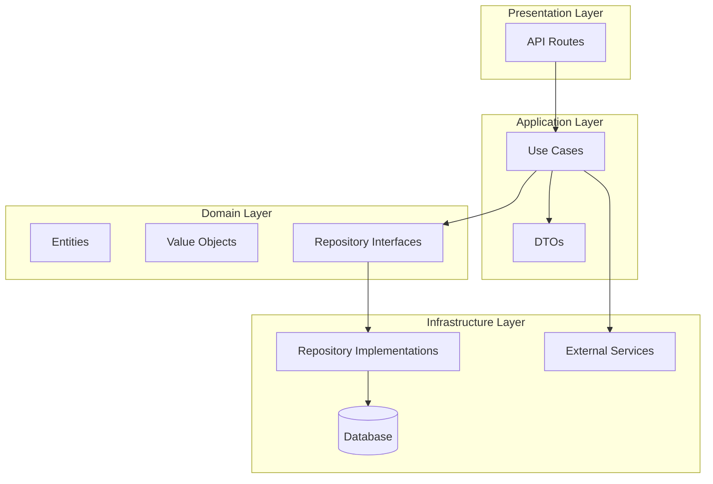
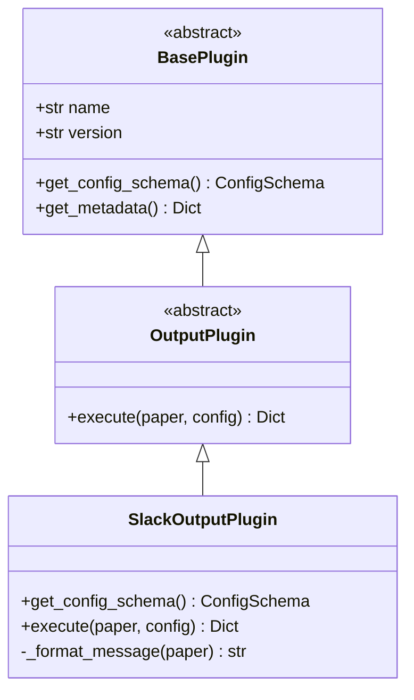

# Mermaid Diagram Generator

## Command Description

Generate Mermaid diagrams based on flexible user input. This command analyzes the user's request and dynamically generates appropriate diagrams for any aspect of the codebase (architecture, class diagrams, workflows, entity relationships, API routes, etc.).

## Usage

```
/mermaid <description>
```

Examples:
- `/mermaid backend architecture`
- `/mermaid workflow execution flow`
- `/mermaid domain entities relationships`
- `/mermaid Paper class structure`
- `/mermaid API routes`
- `/mermaid plugin system`

## AI Instructions

When a user invokes this command, you must:

### 1. Request Analysis

Analyze the user's natural language input to determine:

**Diagram Type:**
- **classDiagram**: For class structures, inheritance, relationships between classes
- **flowchart**: For workflows, processes, data flow, execution flows
- **sequenceDiagram**: For interactions between components, API request/response flows
- **erDiagram**: For entity relationships, database schemas
- **graph**: For architecture diagrams, module dependencies, component relationships

**Scope:**
- Entire codebase (backend, frontend, or both)
- Specific module (e.g., domain, application, infrastructure, presentation)
- Specific directory (e.g., `app/domain/paper`)
- Specific file (e.g., `app/domain/paper/entities/paper.py`)
- Cross-cutting concern (e.g., plugin system, workflow system)

**Focus:**
- Structure: Show organization, layers, modules
- Relationships: Show dependencies, associations, inheritance
- Flow: Show execution flow, data flow, request flow
- Entities: Show domain entities and their relationships

**Context Awareness:**
- If user has a file open, consider it as context
- Use the current file's module/package as default scope if not specified
- Consider related files in the same module

### 2. Code Analysis Guidelines

Use your understanding of the codebase to extract relevant information:

**For Architecture/Structure Diagrams:**
- Map the DDD layers: `domain`, `application`, `infrastructure`, `presentation`
- Identify sub-modules within each layer (e.g., `domain/paper`, `domain/workflow`)
- Show relationships between layers (dependency direction)
- Include external dependencies (FastAPI, database, external services)

**For Class Diagrams:**
- Extract class names, methods, and key attributes
- Identify inheritance relationships (`class Child(Parent)`)
- Identify composition/aggregation (value objects, entities)
- Show relationships between classes (uses, contains, depends on)
- Include dataclasses, Pydantic models, and ORM models

**For Workflow/Flow Diagrams:**
- Analyze workflow execution use cases
- Map the flow from API endpoint → use case → domain service → repository
- Show background task execution
- Include error handling paths
- Show data transformations (DTO → Domain → ORM)

**For Entity Relationship Diagrams:**
- Identify domain entities (Paper, Workflow, Plugin, Category, Config)
- Extract value objects (ArxivId, PdfLink, Summary)
- Show relationships (one-to-many, many-to-many)
- Include repository interfaces and implementations

**For API/Route Diagrams:**
- Map FastAPI routes from `presentation/api/`
- Show HTTP methods (GET, POST, PUT, DELETE)
- Map request/response schemas
- Show dependency injection (repositories, services, clients)
- Include middleware and CORS configuration

**For Plugin System:**
- Show plugin base classes and interfaces
- Map plugin discovery and registration flow
- Show plugin execution flow
- Include plugin configuration system

### 3. Diagram Generation Strategies

**Architecture/Structure Diagrams:**


**Note:** Use single-level subgraphs only. If you need to show sub-modules, create separate nodes within the same subgraph or use multiple subgraphs at the same level.

**Class Diagrams:**
- Use `classDiagram` syntax (NOT `graph` or `flowchart`)
- Show class name, methods (with + for public, - for private), attributes
- Use `--|>` for inheritance, `-->` for associations, `..>` for dependencies
- Include type hints and key attributes

**CRITICAL classDiagram Syntax Rules:**

**DO:**
- ✅ Use `<<abstract>>` stereotype for abstract classes (NOT `{abstract}` in methods)
- ✅ Simplify type annotations - use basic types only (str, int, bool, Dict, List, etc.)
- ✅ Simplify generic types - `List[Dict]` → `List`, `Dict[str, Any]` → `Dict`
- ✅ Omit parameter type hints in method signatures - use parameter names only
- ✅ Keep return types simple - basic types only, no complex generics
- ✅ Omit `__init__` constructors - they're typically not shown in class diagrams
- ✅ Use simple method syntax: `+methodName(param1, param2) ReturnType`
- ✅ Use `<<interface>>` for interfaces, `<<abstract>>` for abstract classes
- ✅ Use `+` for public, `-` for private, `#` for protected members

**DON'T:**
- ❌ NEVER use `{abstract}` syntax in method definitions - abstract methods are just regular methods in `<<abstract>>` classes
- ❌ NEVER include `__init__` constructors in class diagrams
- ❌ NEVER use complex generic types like `List[Dict[str, Any]]` - simplify to `List` or `Dict`
- ❌ NEVER include parameter type hints like `paper: Paper` - use just `paper`
- ❌ NEVER use complex return types with nested generics
- ❌ NEVER use Python-style type hints in classDiagram syntax

**Example - CORRECT:**


**Example - WRONG:**
```mermaid
classDiagram
    class BasePlugin {
        <<abstract>>
        +{abstract} get_config_schema() ConfigSchema  ❌ {abstract} not valid
        +__init__(name: str, version: str)  ❌ __init__ should be omitted
    }
    class OutputPlugin {
        +execute(paper: Paper, config: Dict[str, Any]) Dict[str, Any]  ❌ Complex types
    }
```

- **Important:** If using `graph` or `flowchart` to show class relationships, use regular arrows (`-->`) instead of inheritance syntax (`<|--`)

**Flowcharts:**
- Use `flowchart TD` (top-down) or `flowchart LR` (left-right)
- Use appropriate shapes: `[]` for processes, `{}` for decisions, `()` for start/end
- Show decision points with yes/no branches
- Include error paths and exception handling

**Sequence Diagrams:**
- Use `sequenceDiagram` syntax
- Show participants (API, UseCase, Repository, etc.)
- Map request/response interactions
- Include async operations and background tasks

**ER Diagrams:**
- Use `erDiagram` syntax
- Show entities with key attributes
- Use `||--o{` for one-to-many, `}o--o{` for many-to-many
- Include value objects as embedded entities

### 4. Mermaid Syntax Guidelines

**CRITICAL: Syntax Rules - DO's and DON'Ts**

**DO:**
- Use single-level subgraphs only (NO nested subgraphs)
  - ✅ CORRECT: `subgraph LAYER["Layer Name"]` with ID and quoted label
  - ❌ WRONG: Nested subgraphs like `subgraph "Layer" { subgraph "SubLayer" }`
- Use proper subgraph syntax with IDs:
  - ✅ CORRECT: `subgraph PRES["Presentation Layer"]` or `subgraph "Presentation Layer"`
  - ❌ WRONG: `subgraph Presentation Layer` (missing quotes or ID)
- Use regular arrows (`-->`) for relationships in graph/flowchart diagrams
  - ✅ CORRECT: `BaseClass --> DerivedClass` (for graph diagrams)
  - ✅ CORRECT: `BaseClass <|-- DerivedClass` (ONLY for classDiagram)
- Use proper database node syntax:
  - ✅ CORRECT: `DB[("Database")]` or `DB[(Database)]` for cylinder shape
  - ❌ WRONG: `DB[(Database)]` without proper quoting in some contexts
- Quote subgraph labels that contain spaces or special characters
  - ✅ CORRECT: `subgraph "My Layer"` or `subgraph LAYER["My Layer"]`
- Use dashed arrows for interface implementations:
  - ✅ CORRECT: `Interface -.->|"implements"| Implementation`
- Keep node IDs simple (alphanumeric and underscores only)
  - ✅ CORRECT: `API_PLUGINS`, `DOM_PLUGIN`
  - ❌ WRONG: `API-plugins`, `DOM.plugin` (hyphens/dots cause issues)

**DON'T:**
- ❌ NEVER use nested subgraphs - Mermaid does not support them reliably
- ❌ NEVER use classDiagram inheritance syntax (`<|--`, `--|>`) in graph/flowchart diagrams
  - These syntaxes are ONLY valid in `classDiagram` type diagrams
- ❌ NEVER use unquoted labels in subgraphs with spaces
- ❌ NEVER mix diagram type syntaxes (e.g., classDiagram syntax in graph diagrams)
- ❌ NEVER use special characters in node IDs (use underscores instead of hyphens)
- ❌ NEVER use `{abstract}` in method definitions - use `<<abstract>>` on class only
- ❌ NEVER include `__init__` constructors in classDiagram
- ❌ NEVER use complex generic types like `List[Dict[str, Any]]` - simplify to `List` or `Dict`
- ❌ NEVER include parameter type hints like `paper: Paper` - use just `paper`

**Diagram Type-Specific Syntax:**

**For `graph` or `flowchart` diagrams:**
- Use `-->` for all relationships (dependencies, inheritance shown as regular arrows)
- Use `-.->` for dashed lines (interfaces, optional relationships)
- Use `[("Label")]` for database/cylinder shapes
- Use `[Label]` for rectangular nodes
- Use `{Label}` for diamond/decision nodes
- Use `(Label)` for rounded nodes
- Subgraphs: `subgraph ID["Label"]` or `subgraph "Label"`

**For `classDiagram` diagrams:**
- Use `--|>` for inheritance
- Use `-->` for associations
- Use `..>` for dependencies
- Use `--` for relationships without direction
- Syntax: `ClassA --|> ClassB : inherits`
- **Method syntax:** `+methodName(param1, param2) ReturnType` (NO type hints in parameters)
- **Abstract classes:** Use `<<abstract>>` stereotype, NOT `{abstract}` in methods
- **Type annotations:** Use simple types only (str, int, bool, Dict, List) - NO complex generics
- **Omit constructors:** Do NOT include `__init__` methods
- **Simplify generics:** `List[Dict]` → `List`, `Dict[str, Any]` → `Dict`

**Color Contrast Requirements:**
- Always use high contrast colors for text
- Use dark text colors (#000000, #1a1a1a, #333333) on light backgrounds
- Use light text colors (#ffffff, #f5f5f5) on dark backgrounds
- Avoid light colors (#ffff00, #ffffcc) for text on light backgrounds
- Use classDef to define styles with proper contrast:
  ```mermaid
  classDef domainClass fill:#e1f5ff,stroke:#01579b,stroke-width:2px,color:#000000
  classDef appClass fill:#f3e5f5,stroke:#4a148c,stroke-width:2px,color:#000000
  ```

**Best Practices:**
- Keep diagrams readable and not overly complex
- Use meaningful node labels
- Group related components in subgraphs (single-level only)
- Use consistent naming conventions
- Include only relevant details (don't show every method/attribute)
- Use directional arrows to show dependency flow
- Test syntax before finalizing - ensure all subgraphs are properly closed
- Use node IDs that are descriptive but simple (avoid special characters)

### 5. Project-Specific Architecture Understanding

This project follows **Domain-Driven Design (DDD)** architecture:

**Domain Layer** (`app/domain/`):
- Entities: Core business objects (Paper, Workflow, Plugin, Category, Config)
- Value Objects: Immutable objects (ArxivId, PdfLink, Summary)
- Repository Interfaces: Abstract data access contracts

**Application Layer** (`app/application/`):
- Use Cases: Business logic orchestration
- DTOs: Data transfer objects for API communication
- Plugin System: Plugin registry and executor

**Infrastructure Layer** (`app/infrastructure/`):
- Database: ORM models, repository implementations, database connection
- External Services: ArxivClient, PdfClient, LLMClient
- Mappers: Domain ↔ ORM conversions
- Services: ConfigLoader, TextCleaner, WorkflowStatusManager
- Plugins: Plugin loader and concrete plugin implementations

**Presentation Layer** (`app/presentation/`):
- API Routes: FastAPI endpoints
- Schemas: Pydantic models for request/response validation
- Dependencies: Dependency injection setup

**Frontend** (`src/web/frontend/`):
- Next.js application
- Components: React components
- Hooks: Custom React hooks
- API Services: Frontend API clients
- Types: TypeScript type definitions

### 6. Common Diagram Patterns

**Backend Architecture:**
- Show DDD layers with dependencies
- Include external services (arXiv, PDF, LLM)
- Show database connections
- Map plugin system integration

**Workflow Execution:**
- Start from API endpoint
- Show use case execution
- Include background task flow
- Show status management
- Include error handling

**Domain Entities:**
- Show entities and their value objects
- Map relationships between entities
- Include repository interfaces
- Show factory methods and business logic

**API Routes:**
- Map all FastAPI routers
- Show HTTP methods and paths
- Include request/response schemas
- Show dependency injection chain

**Plugin System:**
- Show base plugin classes
- Map plugin discovery process
- Show plugin execution flow
- Include configuration system

### 7. Error Handling

If the request is ambiguous or unclear:
- Ask clarifying questions about:
  - Which part of the codebase (backend/frontend/specific module)
  - What type of diagram (architecture/class/flow/ER)
  - What level of detail (high-level/detailed)
- Provide suggestions based on common use cases
- If a file/module doesn't exist, inform the user and suggest alternatives

If the scope is too large:
- Suggest breaking it down into smaller diagrams
- Focus on the most relevant parts
- Offer to generate multiple diagrams for different aspects

### 8. Output Format

Always output the Mermaid diagram in a markdown code block:

```mermaid
[diagram syntax here]
```

Include a brief description of what the diagram shows, especially for complex diagrams.

### 9. Example Analysis Flow

User input: `/mermaid workflow execution flow`

Analysis:
- Diagram Type: flowchart (execution flow)
- Scope: workflow system (application/workflow, domain/workflow, infrastructure)
- Focus: execution flow from trigger to completion
- Context: workflow-related files

Steps:
1. Identify workflow trigger endpoint (`presentation/api/workflow.py`)
2. Map use case (`application/workflow/use_cases/trigger_parsing_workflow.py`)
3. Show background task execution
4. Map domain services and repositories used
5. Include status management
6. Show error handling paths

Generate flowchart showing the complete execution flow.

---

## Quick Reference: Common Syntax Mistakes to Avoid

**Before generating any diagram, verify:**

1. ✅ **No nested subgraphs** - Use only single-level subgraphs
2. ✅ **Correct inheritance syntax** - Use `--|>` ONLY in `classDiagram`, use `-->` in `graph`/`flowchart`
3. ✅ **Proper subgraph syntax** - Use `subgraph ID["Label"]` or `subgraph "Label"`
4. ✅ **Database nodes** - Use `[("Database")]` for cylinder shape
5. ✅ **Node IDs** - Use only alphanumeric and underscores (no hyphens, dots, or special chars)
6. ✅ **Quoted labels** - Always quote subgraph labels with spaces or special characters
7. ✅ **classDiagram syntax** - NO `{abstract}`, NO `__init__`, NO complex generics, NO parameter type hints

**Syntax Quick Check:**
- `graph`/`flowchart`: Use `-->` for all relationships
- `classDiagram`: Use `--|>` for inheritance, `-->` for associations
  - Methods: `+method(param1, param2) ReturnType` (simple types only)
  - Abstract: Use `<<abstract>>` stereotype, NOT `{abstract}` in methods
  - Omit: `__init__` constructors, parameter type hints, complex generics
- Subgraphs: Single level only, use IDs and quoted labels
- Node shapes: `[]` rectangle, `()` rounded, `{}` diamond, `[("")]` cylinder

---

## Implementation Notes

- This command relies entirely on AI analysis - no AST parsing or external scripts
- The AI should use codebase_search, read_file, and grep tools to understand the codebase
- Generate diagrams that are accurate, readable, and useful for documentation
- Always ensure high contrast colors for accessibility
- Keep diagrams focused and not overly complex
- **ALWAYS validate syntax** - Check for nested subgraphs, correct arrow types, and proper quoting before finalizing

